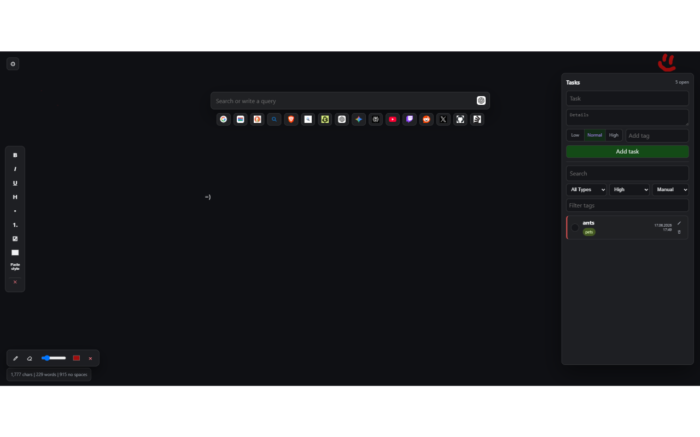

# Kamikire

New tab workspace with a notepad, multi-service search, tasks, drawing, and live text statistics.

## Features

- Replace the browser new tab page with a focused writing workspace
- Search across configurable search engines from one search bar
- Edit, reorder, favorite, import, and export search engines
- Write rich text notes with formatting controls and link highlighting
- Manage tasks with tags, priorities, filters, sorting, editing, and drag-and-drop ordering
- Draw on a scrollable background layer behind the workspace
- Show live text statistics for characters, words, and selected text
- Customize layout width, colors, visible toolbars, and panel visibility
- Import and export settings, tasks, and all local workspace data

## Privacy

- Notes, tasks, drawings, search settings, and preferences are stored locally in the browser
- The extension does not collect or send workspace data to external servers

## Installation

- 🟢 [Chrome Web Store](https://chromewebstore.google.com/detail/cbnckphcidaefmefikjobdjkfnojfnno)
- 🦊 [Firefox Add-ons](https://addons.mozilla.org/firefox/addon/kamikire/)

## Screenshots

**1. New tab workspace with the task panel and background drawing enabled**

## Contributing

Feel free to open issues or submit pull requests to improve the extension.
